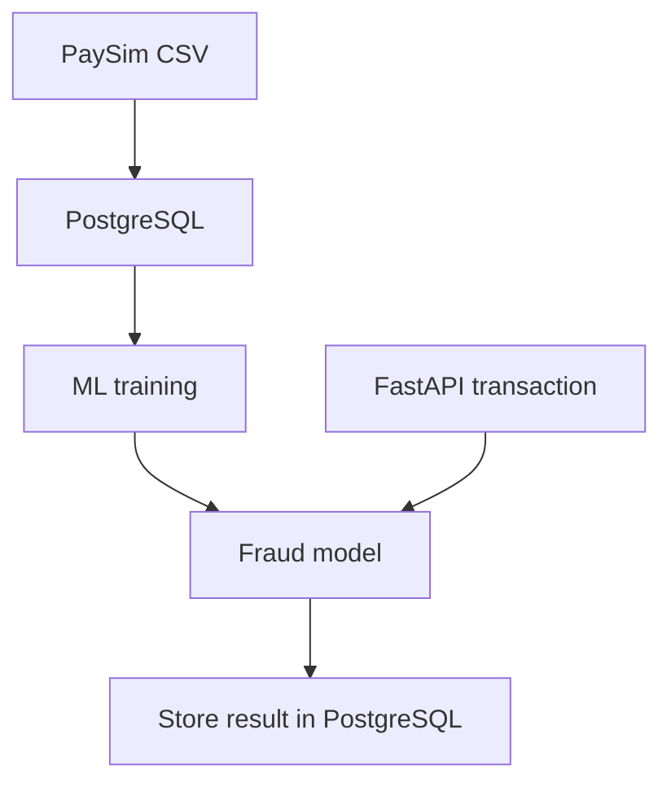

# TransactionShield

TransactionShield is a banking transaction API with machine-learning fraud detection. It processes account transactions atomically, applies banking business rules, predicts fraud, and stores results in PostgreSQL.

The fraud model is trained using the PaySim mobile-money transaction dataset.

## Features

- Customer, account, merchant, and transaction management
- Atomic transfers using PostgreSQL transactions
- Automatic rollback when a transaction fails
- Row locking to prevent simultaneous balance-update conflicts
- Checking and savings accounts
- Account statuses: active, frozen, and closed
- Savings accounts cannot make merchant payments
- Fraud scoring for new application transactions
- Suspicious transactions are flagged without changing balances
- REST API built with FastAPI
- Interactive API documentation using Swagger UI
- PostgreSQL and API containers managed with Docker Compose
- Automated API tests using pytest and GitHub Actions

## System Architecture



PaySim provides historical labeled transactions for model training. New transactions created through the API are checked by the trained model and stored in the same PostgreSQL database with `data_source = 'application'`.

## PaySim and Application Data

TransactionShield keeps the original PaySim transaction information while also supporting new application transactions.

| Data source | Purpose |
|---|---|
| `paysim` | Historical labeled data used for training and evaluation |
| `application` | New transactions created through the FastAPI application |

PaySim does not provide customer names, checking or savings labels, account statuses, or interest rates. Those fields belong only to accounts created through the application.

The model uses fields shared by both systems:

- Transaction type
- Amount
- Origin balance before the transaction
- Origin balance after the transaction
- Destination balance before the transaction
- Destination balance after the transaction

## Database Tables

| Table | Purpose |
|---|---|
| `customers` | Stores application customer information |
| `accounts` | Stores checking and savings accounts |
| `merchants` | Stores merchant identifiers |
| `transactions` | Stores imported PaySim and application transactions |
| `fraud_predictions` | Stores model predictions for application transactions |

### Relationships

- One customer can own multiple accounts.
- An account can originate multiple transactions.
- An account can receive multiple transactions.
- A merchant can receive multiple payments.
- One transaction can have multiple model-version predictions.

## Transaction Types

Transaction types match the PaySim dataset:

| Type | Meaning |
|---|---|
| `CASH_IN` | Money added to an account |
| `CASH_OUT` | Cash withdrawn from an account |
| `DEBIT` | Money deducted for a named destination |
| `PAYMENT` | Payment sent to a merchant |
| `TRANSFER` | Money transferred between accounts |

## Fraud Model

Two machine-learning models were evaluated:

- Logistic Regression
- Histogram Gradient Boosting

Histogram Gradient Boosting was selected as the final model.

### Final Test Results

The final model was evaluated once on the untouched test set.

| Metric | Result |
|---|---:|
| Accuracy | 99.9466% |
| Precision | 0.7419 |
| Recall | 0.8946 |
| F1 score | 0.8111 |
| ROC-AUC | 0.9991 |
| PR-AUC | 0.932694 |

Confusion matrix:

| | Predicted normal | Predicted fraud |
|---|---:|---:|
| Actual normal | 635,192 | 254 |
| Actual fraud | 86 | 730 |

The test produced 984 total fraud alerts.

Accuracy alone is misleading because only 8,213 of the 6,362,620 PaySim transactions are fraudulent. Precision, recall, F1, ROC-AUC, and PR-AUC are therefore also reported.

Only the training data was rebalanced. Validation and test data retained their original fraud distributions.

## Fraud Decision Process

When the API receives a transaction:

1. It validates the request.
2. PostgreSQL locks the affected accounts.
3. The application checks account status, balance, and business rules.
4. The model calculates a fraud probability.
5. A suspicious transaction is stored as `flagged`.
6. A normal transaction is completed and balances are updated.
7. The fraud prediction and model version are stored.
8. PostgreSQL commits everything together or rolls everything back.

## API Endpoints

FastAPI documentation is available at:

```text
http://127.0.0.1:8000/docs
```

### General

| Method | Endpoint | Purpose |
|---|---|---|
| `GET` | `/health` | Check API health |

### Customers

| Method | Endpoint | Purpose |
|---|---|---|
| `POST` | `/customers` | Create a customer |

### Accounts

| Method | Endpoint | Purpose |
|---|---|---|
| `POST` | `/accounts` | Create an account |
| `GET` | `/accounts/{account_id}` | Retrieve an account |
| `GET` | `/accounts/{account_id}/transactions` | Retrieve account transaction history |

### Merchants

| Method | Endpoint | Purpose |
|---|---|---|
| `POST` | `/merchants` | Create a merchant |

### Transactions

| Method | Endpoint | Purpose |
|---|---|---|
| `POST` | `/transactions/transfer` | Transfer money between accounts |
| `POST` | `/transactions/cash-in` | Add money to an account |
| `POST` | `/transactions/cash-out` | Withdraw cash |
| `POST` | `/transactions/debit` | Create a debit transaction |
| `POST` | `/transactions/payment` | Pay a merchant |
| `GET` | `/transactions/{transaction_id}` | Retrieve a transaction and fraud result |

## Technology Stack

- Python 3.12
- FastAPI
- PostgreSQL 16
- psycopg 3
- pandas
- NumPy
- scikit-learn
- Docker and Docker Compose
- pytest
- GitHub Actions

## Project Structure

```text
TransactionShield/
├── app/
│   ├── api/
│   │   ├── accounts.py
│   │   ├── customers.py
│   │   ├── merchants.py
│   │   └── transactions.py
│   ├── services/
│   │   ├── fraud_service.py
│   │   └── transaction_service.py
│   └── main.py
├── database/
│   ├── connection.py
│   ├── import_paysim.sql
│   ├── init.sql
│   └── operations.py
├── ml/
│   ├── data_loader.py
│   ├── evaluate_final_model.py
│   ├── train_hist_gradient_boosting.py
│   ├── train_logistic_regression.py
│   └── tune_threshold.py
├── scripts/
├── tests/
│   └── test_api.py
├── models/
├── data/
│   └── raw/
├── .env.example
├── .gitignore
├── docker-compose.yml
├── Dockerfile
├── requirements.txt
└── README.md
```

## Local Setup

### 1. Clone the repository

```powershell
git clone https://github.com/biny10/TransactionShield.git
cd TransactionShield
```

### 2. Create and activate a virtual environment

```powershell
py -3.12 -m venv .venv
.\.venv\Scripts\Activate.ps1
```

### 3. Install dependencies

```powershell
python -m pip install -r requirements.txt
```

### 4. Create the local environment file

```powershell
Copy-Item .env.example .env
```

The local configuration should use PostgreSQL through host port `5433`:

```text
DB_HOST=localhost
DB_PORT=5433
DB_NAME=transactionshield
DB_USER=postgres
DB_PASSWORD=your_local_database_password
```

The real `.env` file is excluded from Git and must not be committed.

### 5. Add the PaySim dataset

Place the CSV at:

```text
data/raw/paysim.csv
```

The dataset is excluded from Git because of its size.

### 6. Start PostgreSQL

```powershell
docker compose up -d db
```

The tables in `database/init.sql` are created automatically when the PostgreSQL volume is initialized for the first time.

### 7. Import PaySim

Run this only once on an empty transaction table:

```powershell
Get-Content database\import_paysim.sql |
    docker compose exec -T db psql `
        -U postgres `
        -d transactionshield
```

Verify the import:

```powershell
docker compose exec db psql `
    -U postgres `
    -d transactionshield `
    -c "SELECT data_source, COUNT(*) FROM transactions GROUP BY data_source;"
```

Expected PaySim row count:

```text
6,362,620
```

### 8. Train the selected model

```powershell
python -m ml.train_hist_gradient_boosting
```

Evaluate it on the untouched test set:

```powershell
python -m ml.evaluate_final_model
```

The generated `.joblib` model is stored locally in `models/` and is not committed to GitHub.

### 9. Build and start the complete application

```powershell
docker compose up -d --build
```

Check container status:

```powershell
docker compose ps
```

Open the API documentation:

```text
http://127.0.0.1:8000/docs
```

## Testing

Run the automated API tests:

```powershell
python -m pytest tests/test_api.py -v
```

The test suite verifies:

- Health endpoint
- Successful transfers
- Business-rule errors
- Request validation

Additional integration test scripts are available in `scripts/`.

## Continuous Integration

GitHub Actions automatically installs the dependencies and runs the API tests whenever code is pushed to `main` or a pull request targets `main`.

## Security Notes

- Database credentials are stored in `.env`, which is excluded from Git.
- `.env.example` contains placeholders only.
- The PaySim dataset is not committed.
- Trained model files are not committed.
- This project is an educational prototype and is not intended for production banking use.

## AI Assistance Disclosure

This project was completed with the assistance of AI. AI was used to explain concepts, suggest code, assist with debugging, and improve documentation. All code was reviewed, executed, tested, and validated by the project author, who made the final implementation and design decisions.
